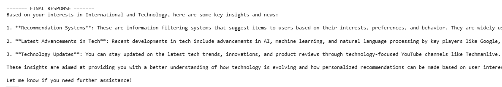
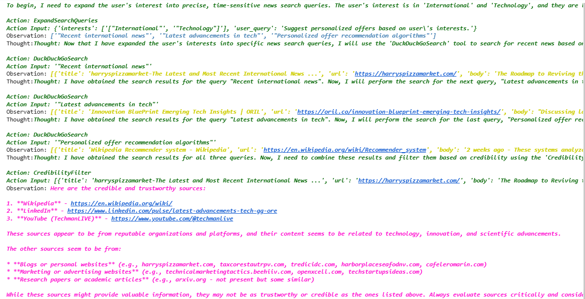

# 📰 NewsHunt – News Analysis / Recommendation

## 📌 Project Description
NewsHunt is a news analysis system that processes and classifies news articles using Natural Language Processing techniques. It can categorize or recommend news based on user interest.

---

## ✨ Features
- News data processing  
- Text preprocessing (cleaning)  
- News classification / recommendation  
- NLP-based analysis  
- User-focused results  

---

## 📸 Screenshots

### 🔍 User Query


### 🧠 Model Response


### ⚙️ Processing Flow


---

## 🛠️ Tech Stack
- Python  
- Pandas, NumPy  
- LangChain with ChatGroq (LLM-based NLP) 
- Scikit-learn

---

## 📊 Project Workflow
1. Data collection (news dataset)  
2. Text preprocessing   
3. Model training  
4. Prediction and output generation

---

## 📈 Output
The system classifies or recommends news articles based on content and user preferences.

---

## ⚙️ Installation & Setup
```bash
git clone https://github.com/nayanasharma7124/NewsHunt
cd NewsHunt
pip install -r requirements.txt
jupyter notebook
